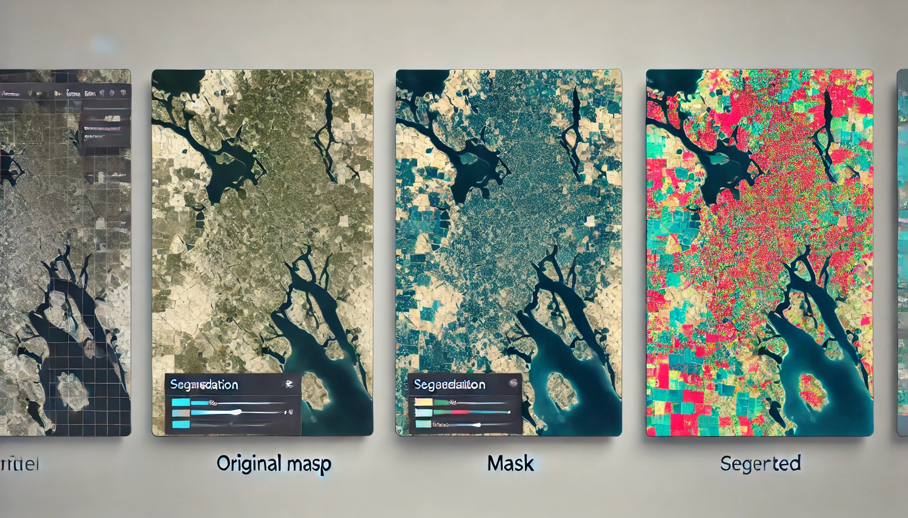

### Introdução
Principais componentes, conceitos, e materiais comprendidos dentro do repositório de disseminação de ferramentas SIG em python são apresentados. Para instigar o leitor já são mostrados exemplos sucintos de uso das ferramentas python. Há espaço também para uma explanação acerca do satélite CBERS-04. Uma introdução à tecnica de segmentação de imagens é feita.

## Geoprocessamento
O geoprocessamento é o conjunto de técnicas e tecnologias utilizadas para a coleta, processamento, análise e apresentação de dados geoespaciais. Envolve a manipulação de informações geográficas para criar mapas, realizar análises espaciais, modelar fenômenos e tomar decisões baseadas em dados espaciais. O geoprocessamento combina conhecimentos de cartografia, sensoriamento remoto, Sistemas de Informação Geográfica (SIG), entre outros campos, para fornecer uma visão abrangente e detalhada do mundo ao nosso redor.

## Sistemas de Informação Geográfica (SIG)
Os Sistemas de Informação Geográfica (SIG) são ferramentas tecnológicas que permitem a coleta, armazenamento, análise, gestão e visualização de dados geoespaciais. Eles integram informações de diferentes fontes para criar uma representação detalhada do mundo real, facilitando a análise espacial e a tomada de decisões informadas. Algumas ferramentas SIG encontoradas em python são: GeoPandas, Shapely, Fiona, Rasterio, GDAL/OGR.

#### GeoPandas
GeoPandas é uma biblioteca que facilita o uso de dados espaciais em Python. Ela estende as funcionalidades do Pandas para permitir a manipulação de geometrias, facilitando operações como leitura, escrita e análise de dados geoespaciais.

```python 
import geopandas as gpd

# Carregar um shapefile
gdf = gpd.read_file('path/to/shapefile.shp')

# Plotar os dados geoespaciais
gdf.plot()
```

#### Shapely
Shapely é uma biblioteca para a manipulação e análise de objetos geométricos em Python. Ela permite criar, manipular e realizar operações sobre formas geométricas, como pontos, linhas e polígonos.

```python
from shapely.geometry import Point, Polygon

# Criar um ponto
point = Point(1, 1)
p, (1, 1), (1, 0)])

# Verificar se o ponto está dentro do polígono
print(polygon.contains(point))
```

#### Fiona 
Fiona é uma biblioteca para leitura e escrita de dados geoespaciais. Ela permite interagir com diferentes formatos de arquivos geoespaciais, como shapefiles e GeoJSON.

```python
import fiona

# Abrir um shapefile
with fiona.open('path/to/shapefile.shp', 'r') as shapefile:
    for feature in shapefile:
        print(feature)
```

#### Rasterio
Rasterio é uma biblioteca para a leitura e escrita de arquivos raster. Ela permite manipular e analisar dados raster, como imagens de satélite e modelos digitais de elevação.

```python
import rasterio
from rasterio.plot import show

# Abrir um arquivo raster
with rasterio.open('path/to/raster.tif') as src:
    # Mostrar a imagem raster
    show(src)
```

#### GDAL/OGR
GDAL (Geospatial Data Abstraction Library) e OGR são bibliotecas poderosas para a manipulação de dados raster e vetor, respectivamente. Elas fornecem uma ampla gama de funcionalidades para a leitura, escrita e processamento de dados geoespaciais.

```python
from osgeo import gdal

# Abrir um arquivo raster
dataset = gdal.Open('path/to/raster.tif')

# Obter informações sobre o raster
print(dataset.RasterXSize, dataset.RasterYSize, dataset.RasterCount)

```

## CBERS-04
O CBERS-04 é um satélite de sensoriamento remoto desenvolvido como parte do programa China-Brazil Earth Resources Satellite (CBERS), uma colaboração entre o Brasil e a China. Lançado em 7 de dezembro de 2014, o CBERS-04 foi projetado para substituir o CBERS-3, que falhou ao alcançar a órbita em dezembro de 2013. O satélite tem como objetivo fornecer imagens de alta resolução para diversas aplicações, incluindo monitoramento ambiental, gestão de recursos naturais, agricultura de precisão e resposta a desastres.

## Segmentação de imagens
Uma máscara de segmentação é uma técnica utilizada em processamento de imagens e análise de dados geoespaciais para identificar e isolar objetos ou regiões específicas dentro de uma imagem. Em termos simples, uma máscara de segmentação é uma imagem binária ou multiclasse onde os pixels são classificados de acordo com a classe do objeto a que pertencem. Aplicações das máscaras são:
* **Agricultura de precisão**: identificação de mudanças no uso da terra, como desmatamento ou urbanização; monitoramento de habitats e avaliação da degradação ambiental.
* **Planejamento urbano**: análise de expansão urbana e desenvolvimento de infraestrutura; identificação de diferentes tipos de terrenos e seu uso.
* **Resposta a desastres**: mapeamento de áreas afetadas por desastres naturais, como enchentes ou incêndios florestais; avaliação de danos e planejamento de ações de recuperação.
* **Visão computacional**: segmentação de objetos em imagens para aplicações em robótica e automação; reconhecimento de padrões em imagens médicas para diagnósticos assistidos por computador.

Uma ilustração do process de segmentação é apresentado. Nesse exemplo o mapa orignal (mapa da esquerda) passa por um processo de segmentação por meio do uso da máscara (mapa central) que modo a resultas em uma mapa segmentando, isto é, com especificação de diferentes padões de interesse que podem ser, por exemplo, área urbana, área de floresta, área de protenção ambiental e etc.

